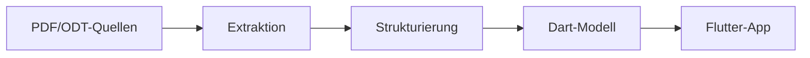

## 1. Die Daten

Die Rohdaten für die App liegen unter `doc/ich/` und müssen in ein passendes Format überführt werden – z. B. JSON oder ein strukturiertes Datenmodell in Dart (siehe unten).

Derzeit befinden sich dort:
- `Lebenslauf-MatthiasStruck_21052026_bq.pdf` – Lebenslauf als PDF
- `Matthias_Struck_13072026.pdf` – weiterer Lebenslauf als PDF
- `Matthias_Struck(2).odt` – Lebenslauf als LibreOffice-Dokument
- `Matthias Struck - Zertifikat(1).pdf` / `... (komprimiert)(1).pdf` – Zertifikate als PDF
- `MatthiasStruck.jpg` / `MatthiasStruck_pass.jpg` – Portraitfotos

### Automatisierte Verarbeitung (Daten-Pipeline)

Ziel ist es, die Daten möglichst weitgehend automatisiert aus den Quellen zu extrahieren, zu vereinheitlichen und in ein von Flutter konsumierbares Format zu bringen. Dazu wird folgende Pipeline empfohlen:



#### 1. Extraktion (PDF → Rohdaten)

| Tool / Bibliothek                  | Einsatzzweck                                                         |
|------------------------------------|----------------------------------------------------------------------|
| **Python: `pdfplumber` / `pymupdf`** | Text und Tabellen aus `*.pdf` extrahieren                            |
| **Python: `python-odf-tools`**     | Text aus `*.odt` extrahieren                                         |
| **Python: `spacy` / `regex`**      | Strukturierte Felder (Name, Titel, Daten, Firmen) erkennen           |
| **OCR-Erweiterung: `pytesseract`** | Gescannte PDFs (falls vorhanden) per Texterkennung erschließen       |

**Empfehlung:** Ein Python-Skript (`scripts/extract_data.py`), das alle Dateien in `doc/ich/` durchläuft, Inhalte extrahiert und als Zwischenergebnis eine `raw_data.json` ablegt.

#### 2. Strukturierung (Rohdaten → normiertes JSON)

Aus den extrahierten Rohdaten wird ein einheitliches Schema abgeleitet:

```json
{
  "person": {
    "name": "Matthias Struck",
    "photo": "assets/images/MatthiasStruck.jpg"
  },
  "entries": [
    {
      "type": "experience",
      "title": "Senior Developer",
      "organization": "Firma XYZ",
      "startDate": "2020-01",
      "endDate": "2025-06",
      "description": "Verantwortlich für …",
      "tags": ["Flutter", "Python", "Teamlead"]
    },
    {
      "type": "certificate",
      "title": "Zertifikat: Cloud Architect",
      "issuer": "AWS",
      "date": "2023-11",
      "file": "assets/docs/cert-aws-cloud-arch.pdf"
    },
    {
      "type": "education",
      "title": "M.Sc. Informatik",
      "organization": "TU Musterstadt",
      "startDate": "2012-10",
      "endDate": "2016-09"
    }
  ],
  "skills": [
    { "name": "Flutter", "category": "Framework", "level": 5 },
    { "name": "Python",  "category": "Sprache",  "level": 4 }
  ]
}
```

Das JSON wird durch ein Transformations-Skript (`scripts/transform_data.py`) aus der `raw_data.json` erzeugt und als `data/cv.json` abgelegt.

#### 3. Dart-Datenmodell (aus JSON generiert)

Aus dem normierten JSON wird idealerweise automatisch ein typsicheres Dart-Modell generiert, z. B. mit **`json_serializable`** oder **`freezed`**:

```dart
import 'package:json_annotation/json_annotation.dart';

part 'cv_data.g.dart';

@JsonSerializable()
class CvData {
  final Person person;
  final List<CvEntry> entries;
  final List<Skill> skills;

  CvData({required this.person, required this.entries, required this.skills});

  factory CvData.fromJson(Map<String, dynamic> json) => _$CvDataFromJson(json);
  Map<String, dynamic> toJson() => _$CvDataToJson(this);
}

@JsonSerializable()
class CvEntry {
  final String type;       // "experience" | "certificate" | "education"
  final String title;
  final String? organization;
  final String? startDate;
  final String? endDate;
  final String? description;
  final String? issuer;
  final String? file;
  final List<String>? tags;

  CvEntry({ /* … alle Felder */ });

  factory CvEntry.fromJson(Map<String, dynamic> json) => _$CvEntryFromJson(json);
}

@JsonSerializable()
class Skill {
  final String name;
  final String category;
  final int level;

  Skill({required this.name, required this.category, required this.level});

  factory Skill.fromJson(Map<String, dynamic> json) => _$SkillFromJson(json);
}
```

Nachteil der manuellen Wartung: Jede Änderung an der `cv.json` erfordert ein erneutes Generieren der `.g.dart`-Dateien. **Besser:** Der Build-Prozess der App liest die `cv.json` zur Laufzeit oder übersetzt sie über einen `build_runner`-Schritt.

### Empfohlene Projektstruktur (scripts/)

```
Lebenslauf-und-CoKg/
├── doc/
│   ├── ich/                  # Rohdaten (PDF, ODT, JPG)
│   └── plan/                 # Planungsdokumente
├── data/
│   └── cv.json               # Normierte Daten (von Skript erzeugt)
├── scripts/
│   ├── extract_data.py       # Extraktion aus PDF/ODT → raw_data.json
│   ├── transform_data.py     # raw_data.json → cv.json
│   └── requirements.txt      # Python-Abhängigkeiten (pdfplumber, spacy, …)
├── lib/
│   ├── models/
│   │   ├── cv_data.dart
│   │   ├── cv_data.g.dart    # automatisch generiert
│   │   ├── cv_entry.dart
│   │   ├── cv_entry.g.dart
│   │   ├── skill.dart
│   │   └── skill.g.dart
│   └── …                     # restliche Flutter-App
└── assets/
    ├── images/
    └── docs/
```

### Workflow (vollautomatisch)

1. **Neue PDF/ODT-Datei** wird in `doc/ich/` abgelegt.
2. **Manuell oder per Cron**: `python scripts/extract_data.py` und `python scripts/transform_data.py` ausführen → `data/cv.json` wird aktualisiert.
3. **Git-Commit** der neuen Quellen + der aktualisierten `cv.json`.
4. **GitHub Actions** baut die Flutter-App → neue CV-Version ist live.

Damit ist der Prozess **weitgehend automatisiert** und dennoch flexibel genug für manuelle Korrekturen (z. B. Nachbearbeitung der `cv.json` von Hand, falls die Extraktion ungenau war).